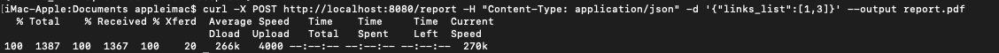
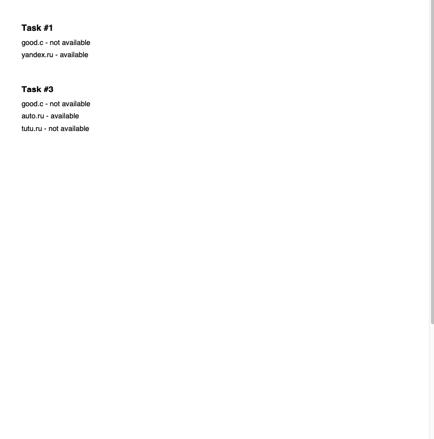

# Сервис проверки доступности url адресов.
Реализован сервис благодаря которому пользователь может получить информацию о доступности различных url адресов. Также пользователь может получить отчет о ранее сделанных запросах и получить его в формате pdf.

# Взаимодействие с сервисом
Взаймодействие происходит про помощи curl запросов. Сервер запускается на localhost:8080 . Пример запроса типа /check для проверки доступности представлен снизу. 
Пример запроса типа /report для создания pdf отчета прдеставлен снизу. 
PDF отчет, полученный в результате предыдущего запроса представлен ниже и в файле report.pdf . 

# Описание структуры проекта
При запуске main создается сервер по адресу localhost:8080. Также создается WaitGroup и 3 обработчика внутри нее, чтобы одновременно обрабатывать несколько запросов и не прерывать исполнение текущих запросов при неожиднанном завершении работы сервера. Обработчики берут запросы из очереди запросов. В эту очередь запросы попадают из запросов пользователя. Запросы хранятся в файле data/tasks.json . Также в файле data/counter.txt хранится общее число запросов. В случае, если часть запросов из очереди не была обработана до момента окончания работы сервера, при повторном запуске сервера идет обработка этих запросов. Для этого внутри каждого запроса есть отдельное булевое поле "done", по которому сервис понимает, что часть запросов осталась не обработана, и в первую очередь надо обработать именно их. При успешной обработке запроса значение поля становится равным true. Проверка доступности сервера идет через обычный запрос http.Client.Get(url). Генерация pdf отчета происходит при помощи библиотеки gofpdf.
